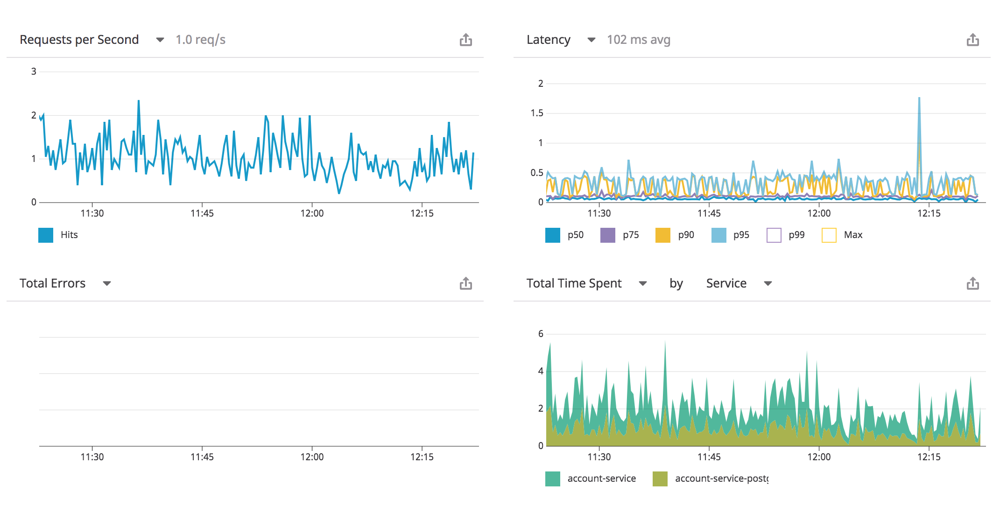
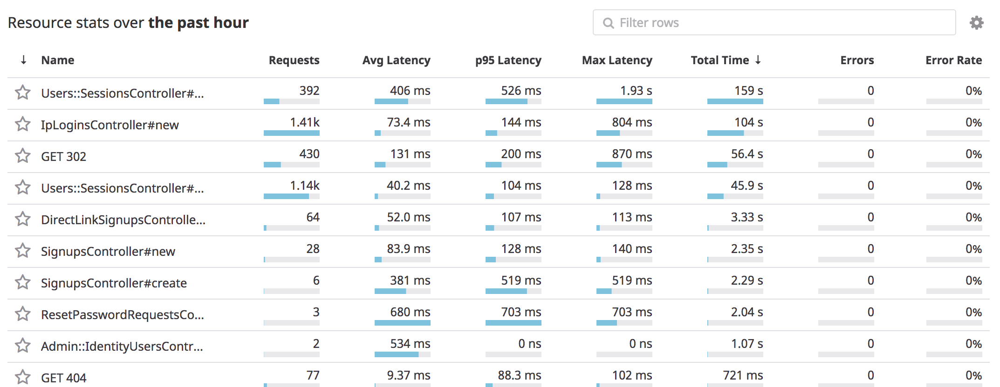
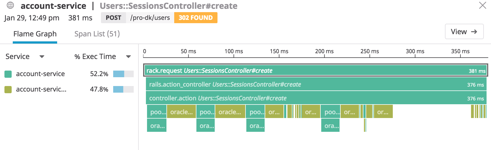

@snap[west]

@snapend

@snap[east]
# Introduction to datadog
@snapend

---

## Agenda

@ul
* Application Performance Monitoring
* Metrics
* Dashboards
@ulend

---
@title[Application Performance Monitoring]

## Application Performance Monitoring / APM

@ul
* Monitor traffic and performance
* Record traces
* At the application level
@ulend

Note:

- Datadog understands a Rails application
- The data is grouped logically along the lines of Rails
- I'll go through the features and then do a demo

---
@title[Traffic and performance monitoring]

---
@title[Traffic and performance monitoring]

---
@title[Application traces]

---
@title[Demo]

## Demo

---
@title[Metrics]

## Metrics

* Built in
* Custom metrics

---

## Notes

- Deep tracing with custom trace points

- Custom metrics for specific endpoints (showing how to graph a single endpoints performance)
