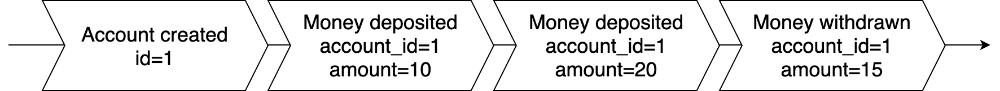
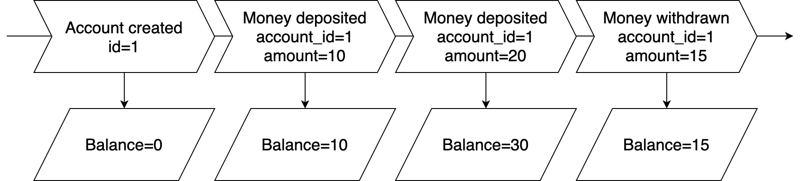
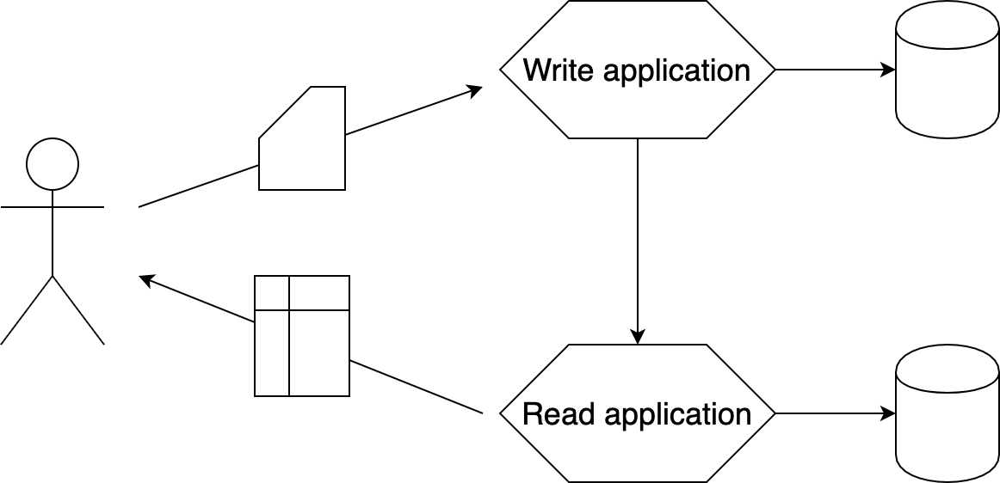
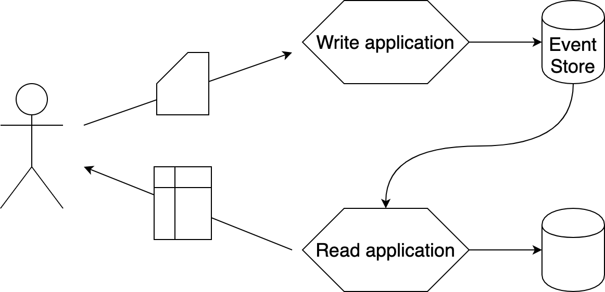
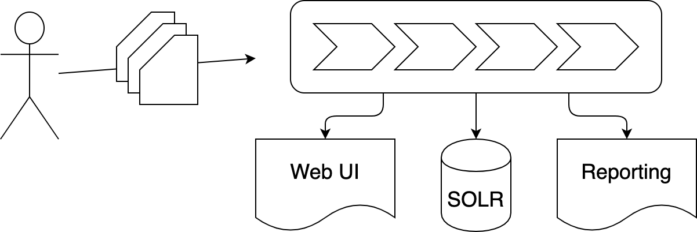

## Events, Event Sourcing, and CQRS

Note:

- High level introduction
- I hope you will come away with some inspiration that there are other ways of
  doing things

---?color=white&image=assets/img/big_bank.1.jpg&size=contain

Note:

- Imagine a bank. You go and make a deposit. The teller whips out their
  calculator and adds your deposit and the current balance. He then takes out
  an eraser, erases the current balance and writes the new balance.

---?color=white

Note:

- It could look like this
- This is not how banks work.

---?color=white

Note:

- We can derive the current balance

---?color=white

Note:

- We can see the states as every event is applied

---
## State of system design

@ul
* Store the current state in the database
* REST / GraphQL
* Maybe a message queue
@ulend

Note:

- This is how we've been building systems for the past many years
- If you want to update data you go and overwrite what's in the database
- You put an API in front of it
- If you're fancy you might put a message queue in to temporally decouple systems

---
## Issues with the current approach

@ul
* Performance / scalability, especially for micro services
* History is lost
* Leads to highly coupled systems
@ulend

Note:

- When designing systems the way we do today it leads us towards the
  distributed monolith (aka. death star architecture)
  - Services become dumb data holders
- Whenever an update or delete statement runs history is lost
- Run on effects: Debugging
- Because we don't have an easy way to distribute state it's easier to just add
  the next feature to the existing codebase

---
## Events

@ul
* A historical fact
* Related to an entity
@ulend

Note:

- Let's change pace a bit and talk about events
- It happened in the past, so we name it in the past tense
- It's a fact
- So it can't change
- Typically related to a single entity, for instance a bank account

---
## Example events

@ul
* User signed up
* Document published
* Paragraph annotated
@ulend

Note:

- A couple of examples, all named in the past tense
- Not up for discussion

---
## An event log

@ul
* A log of events
* Every event that ever happened
@ulend

Note:

- Taking the ideas of events a little further
- If we have access to the log we no longer need to ask anyone to figure out
  what the state is

---
## Event Sourcing

@ul
* Using the event log as the source of truth
* Everything else is derived from the event log
@ulend

Note:
- We can only have 1 source of truth so we no longer use the database tables as
  the source of truth

---
## Commands

@ul
* The origin if events
* Imperative
* Causes one or more events
* Can be issued by users or systems
* Can be rejected
@ulend

Note:
- A command is a request from a user or another system to get our system to do
  something
- As opposed to events we can choose to reject or accept the command depending
  on the business rules
- Example: Publish document (can be rejected for invalid documents)

---
## Benefits

@ul
* Higher level language
* Answer historical questions
* Derive new information
* Easier debugging
@ulend

Note:
- We get a language where we can talk about our systems in business terms.
- The domain is reflected closely in code.
- We can answer questions like "what did this look like 3 days ago", "who did this", etc.
- We can extract new information from the events if we're lucky
- It becomes easier to answer the question "How did we end up here?"

---
## CQRS

@ul
* Command/query responsibility segregation
* Split read and write
* A common solution to querying when using Event Sourcing
* Build event projections for reading
@ulend

Note:

- Splitting the code that does writes from the code that does reads
- Not dependent on event sourcing, but fits very well with it
- Event projections can be highly performant as they can be tailored to fix the
  exact usecase

---?color=white

Note:

---?color=white

Note:
---
## Using events for system design

@ul
* Design becomes natural
* Reactive systems instead of active systems
@ulend

Note:

- The design of the system becomes more natural when we can talk about things
  that happens
- Instead of querying other systems we can now invert the dependencies
- Publish events over querying API continuously
- Efficiency

---
## Using events between systems

@ul
* Use integration events
* Decoupled systems
* Easy to add new capabilities
@ulend

Note:

- Allows is to build reactive systems
- We don't have to continuously poll expensive endpoints

---
## Examples today

@ul
* Updating user access to Talent LMS
* AccountService OnlineUser
@ulend

---?color=white

---
## Questions

---
## Thanks
