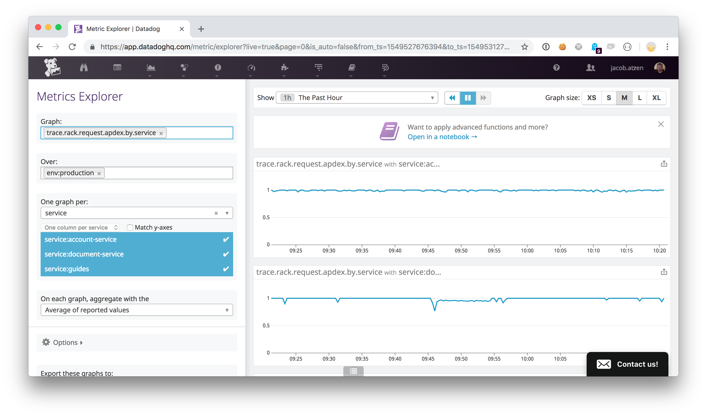
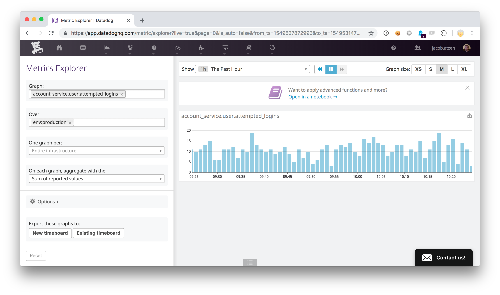
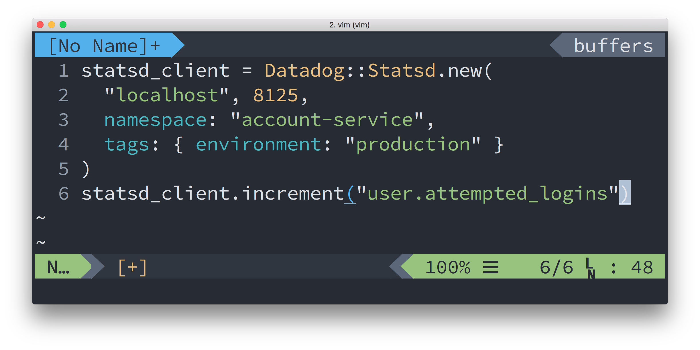
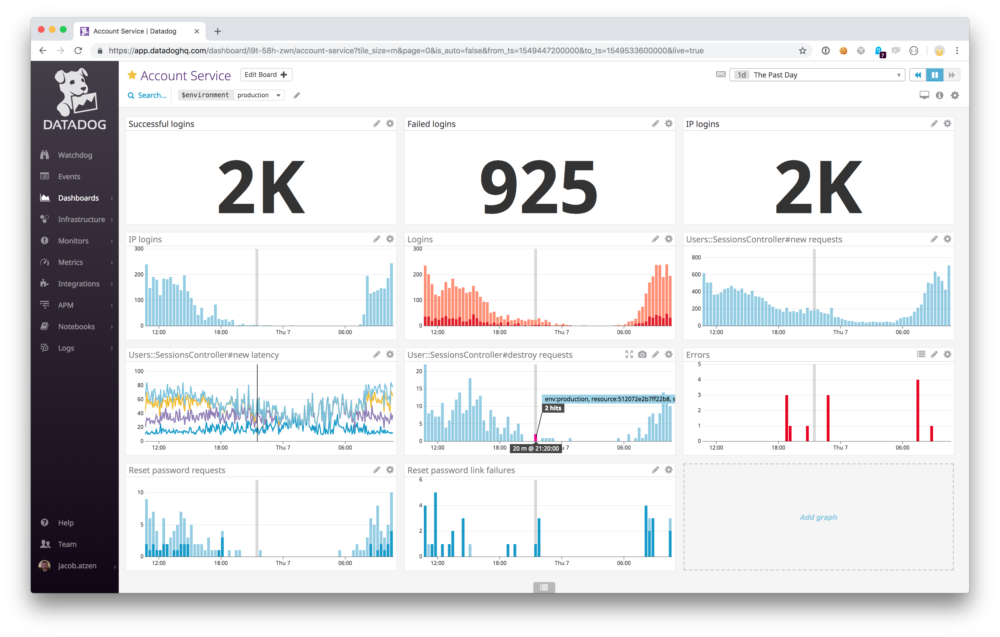
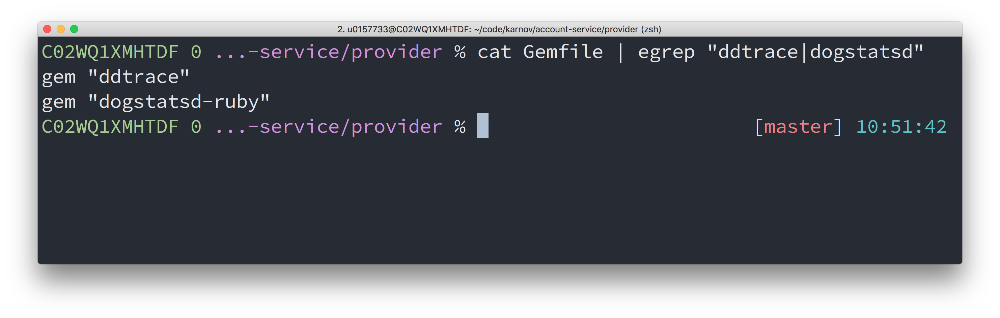
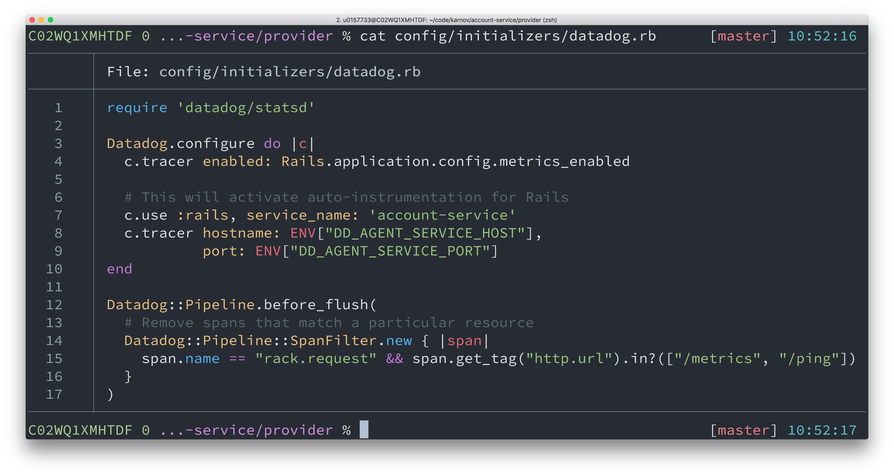

Note:

- Datadog is a monitoring tool that collects various metrics
- The focus today is on application level metrics

---

## Agenda

@ul
* Application Performance Monitoring
* Metrics
* Dashboards
@ulend

Note:

- We'll focus on these three Datadog features today
- This will be at a rather high level to give a sense of what is possible

---
@title[Application Performance Monitoring]

## Application Performance Monitoring / APM

@ul
* How fast is my application?
* How fast is this endpoint?
* Why is it not fast?
@ulend

Note:

- Performance is an important part of the user experience
- A slow application is not a good experience
- Datadog can help giving answers to questions like this
- So how does Datadog provide these answers?

---
@title[Application Performance Monitoring]

## Application Performance Monitoring / APM

@ul
* Monitor traffic and performance
* Record traces
* At the application level
@ulend

Note:

- Datadog understands a Rails application
- The data is grouped logically along the lines of Rails
- I'll go through the features and then do a demo

---
@title[Traffic and performance monitoring]

---
@title[Traffic and performance monitoring]

---
@title[Application traces]

Note:

- Shows Datadogs default tracing capabilities
- Shows custom tracing

---
@title[Demo]

## Demo

---
@title[Metrics]

## Metrics

* Built in
* Custom metrics

---
@title[Metrics]

Note:

- The metrics explorer allows us to discover and view metrics
- We can group data points by various dimensions

---
@title[Metrics]

Note:

- Custom metrics allow us to collect different kinds of time series data
- We're using counts

---
@title[Metrics]

Note:

- This is the code necessary to gather the data

--
@title[Dashboards]

## Dashboards

Note:
- Dashboards can hold any of the time series data we've seen so far
- You can apply functions to the data for more advanced presentations

--
@title[Dashboards]

Note:

- This is the account service dashboard
- It's gathering the most important metrics for account service
- Function application example: Logins failed = attempted - succeeded

--
@title[Dashboards]

## Demo

--
@title[Installation]

--
@title[Installation]

--
## Notes

- Deep tracing with custom trace points

- Custom metrics for specific endpoints (showing how to graph a single endpoints performance)
- Installation
- Formula for graphing
